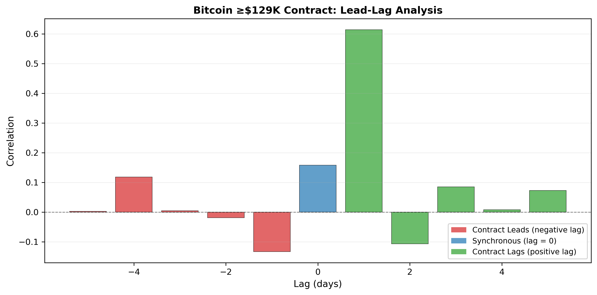
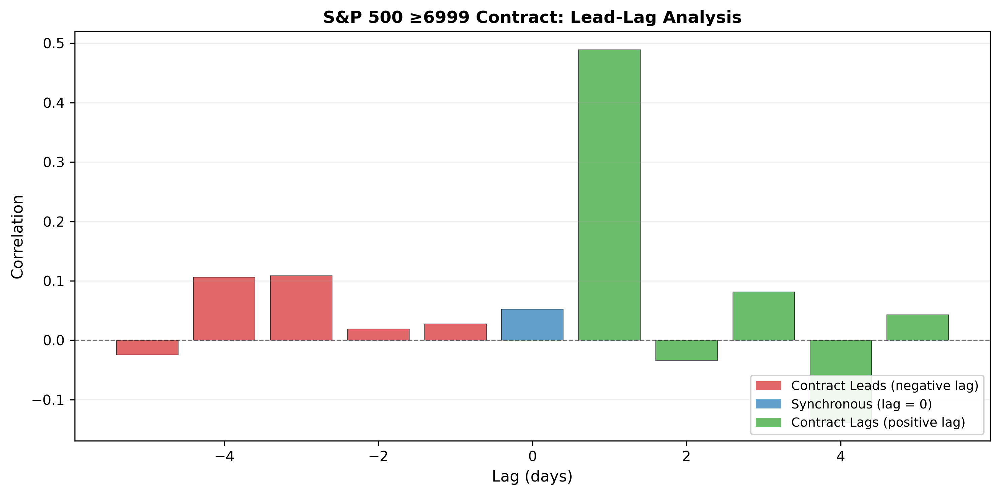
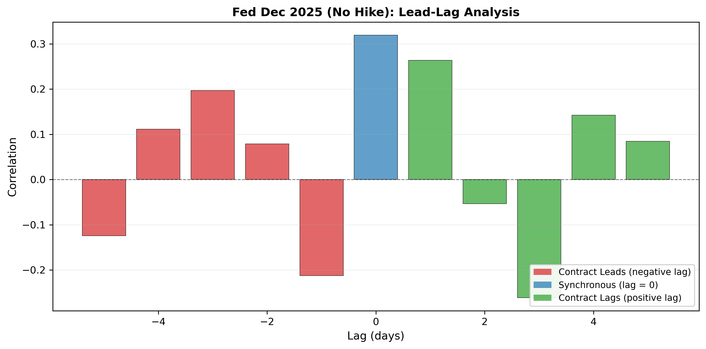

# Prediction Market Efficiency: Analyzing Kalshi Contract Dynamics

**Author:** Emma Nagy  
**Date:** December 2024  
**Platform:** Kalshi (CFTC-regulated prediction market exchange)

[](https://nbviewer.org/github/enagy827/kalshi-prediction-market-analysis/blob/main/AS10_Kalshi_Prediction_Market_Analysis.ipynb)
[](report/AS10_Kalshi_Summary.pdf)

---

## 📊 Project Overview

This project evaluates the efficiency and predictability of prediction markets by analyzing three Kalshi contracts across cryptocurrency, equity indices, and monetary policy. Using correlation analysis, lead-lag dynamics, and machine learning forecasting, the study documents how prediction markets incorporate information and whether historical patterns offer exploitable trading opportunities.

## 🎯 Research Questions

1. **How closely do prediction market contracts track their underlying assets?**
2. **Do contracts lead or lag the markets they reference?**
3. **Can machine learning models identify exploitable patterns in contract price movements?**
4. **How do different prediction market platforms compare for identical events?**

## 📈 Contracts Analyzed

### 1. Bitcoin ≥$129K
- **Contract**: Binary option on Bitcoin closing above $129,000
- **Underlying**: Bitcoin spot price (24/7 global cryptocurrency market)
- **Key Finding**: Contract lags underlying by 1 day (correlation 0.61 at lag +1)
- **Interpretation**: Liquidity-driven delay—prediction market responds after spot price moves appear persistent

### 2. S&P 500 ≥6999
- **Contract**: Binary option on S&P 500 year-end level exceeding 6999
- **Underlying**: S&P 500 index
- **Key Finding**: Synchronous adjustment (correlation 0.49 at lag 0)
- **Interpretation**: Efficient real-time information incorporation without forecasting power

### 3. Federal Reserve December 2025 (No Hike)
- **Contract**: Binary option on Fed maintaining unchanged rates
- **Underlying**: Federal funds rate expectations / CME FedWatch probabilities
- **Key Finding**: Event-driven response (correlation 0.32 at lag 0 with diffuse pattern)
- **Interpretation**: Discrete information incorporation around scheduled announcements (CPI, FOMC)

---

## 🔍 Key Findings

### 1. Efficient Information Incorporation Across Asset Classes

**Level vs. Return Correlations:**
- Bitcoin: 0.95 level correlation, 0.17 return correlation (tracks trend, not volatility)
- S&P 500: 0.80 level correlation, 0.05 return correlation (intermittent adjustments)
- Fed: 0.35 level correlation, 0.32 return correlation (event-driven jumps)

**Interpretation**: Contracts follow broad directional movements more than daily fluctuations. Differences reflect asset characteristics (continuous vs. event-driven) rather than inefficiency.

### 2. No Predictive Power—Contracts React, Don't Anticipate

**Lead-Lag Analysis Results:**
- Bitcoin: Peak at lag +1 (prediction market follows crypto by 1 day)
- S&P 500: Peak at lag 0 (same-day synchronous adjustment)
- Fed: Peak at lag 0 with adjacent lag correlations (event clustering)

**Interpretation**: No consistent evidence of prediction markets forecasting underlying movements. Patterns reflect liquidity constraints (crypto), efficient incorporation (equities), and discrete information releases (policy).

### 3. Weak Machine Learning Performance Confirms Limited Exploitability

**Model Performance:**
- Bitcoin: 82.6% accuracy (unreliable—only 23 test observations)
- S&P 500: 64.3% peak accuracy (marginal improvement over 50% baseline)
- Fed: Unstable results (insufficient test data)
- ROC-AUC: High variance, evidence of overfitting across all models

**Models Tested**: Logistic Regression, Ridge, LASSO, Random Forest, XGBoost, LightGBM, Neural Networks

**Feature Importance**: Lagged returns and short-horizon volatility rank consistently high but don't translate into reliable forecasts.

**Interpretation**: Historical patterns insufficient for systematic prediction. Markets incorporate available information too quickly for mechanical strategies to succeed.

### 4. Platform Consistency: Kalshi vs. CME FedWatch

**Comparison Results:**
- Level correlation: -0.63 (strong negative)
- Return correlation: -0.35 (moderate negative)

**Why Negative?** Inverse contract structures:
- Kalshi measures "no change" probability
- FedWatch distributes probability across all outcomes (when cuts likely, "no change" probability falls)

**Interpretation**: Markets agree but express information through opposite lenses. No timing advantage for either platform—both respond to same information events simultaneously.

### 5. Asset-Specific Efficiency Patterns

**Cryptocurrency (Bitcoin):**
- Liquidity-driven 1-day lag
- Thinner prediction market responds after highly liquid 24/7 spot market
- Economically rational delay (wait for confirmation vs. react to noise)

**Equities (S&P 500):**
- Synchronous adjustment
- Efficient real-time incorporation during standard trading hours
- Binary structure creates discrete probability updates

**Monetary Policy (Fed):**
- Event-driven discrete jumps
- Expectations stable between announcements, shift sharply around data releases
- Reflects scheduled nature of policy communication

---

## 📁 Repository Contents

```
kalshi-prediction-market-analysis/
├── AS10_Kalshi_Prediction_Market_Analysis.ipynb    # Complete analysis notebook
├── data/
│   ├── kalshi_btc_129k.csv                         # Bitcoin contract data
│   ├── kalshi_spx_6999.csv                         # S&P 500 contract data
│   ├── kalshi_fed_dec25_h0.csv                     # Fed contract data
│   ├── btc_prices.csv                              # Bitcoin underlying prices
│   ├── spx_prices.csv                              # S&P 500 underlying prices
│   └── cme_fedwatch.csv                            # CME FedWatch probabilities
├── outputs/
│   └── figures/                                     # Lead-lag charts and ML comparisons
│       ├── kalshi_btc_129k_leadlag.png
│       ├── kalshi_spx_6999_leadlag.png
│       ├── kalshi_fed_dec25_h0_leadlag.png
│       └── ml_model_comparison.png
├── report/
│   └── AS10_Kalshi_Summary.pdf                     # Technical report (LaTeX)
├── requirements.txt                                 # Python dependencies
└── README.md                                        # This file
```

---

## 🚀 How to Run This Analysis

### View Online (No Installation Required)

**[View the interactive notebook on nbviewer →](https://nbviewer.org/github/enagy827/kalshi-prediction-market-analysis/blob/main/AS10_Kalshi_Prediction_Market_Analysis.ipynb)**

### Run Locally

#### Prerequisites
- Python 3.8 or higher
- Jupyter Notebook or JupyterLab

#### Option 1: Using Git

```bash
# Clone the repository
git clone https://github.com/enagy827/kalshi-prediction-market-analysis.git
cd kalshi-prediction-market-analysis

# Install dependencies
pip install -r requirements.txt

# Launch Jupyter
jupyter notebook

# Open AS10_Kalshi_Prediction_Market_Analysis.ipynb and run all cells
```

#### Option 2: Download ZIP

1. Click the green **"Code"** button at the top of this repository
2. Select **"Download ZIP"**
3. Extract the files to your desired location
4. Open terminal/command prompt and navigate to the extracted folder
5. Install dependencies: `pip install -r requirements.txt`
6. Launch Jupyter: `jupyter notebook`
7. Open `AS10_Kalshi_Prediction_Market_Analysis.ipynb` and run the cells

---

## 🛠️ Methodology

### Correlation Analysis
- **Level correlation**: Long-run trend alignment between contract and underlying asset
- **Return correlation**: Day-to-day co-movement patterns
- Identifies whether contracts track broad trends, short-term volatility, or both

### Lead-Lag Dynamics
- Cross-correlation analysis at lags from -5 to +5 days
- Negative lags: Contract leads underlying (predictive power)
- Positive lags: Contract follows underlying (reactive behavior)
- Lag 0: Synchronous adjustment

### Machine Learning Prediction
**Models**: Logistic Regression, Ridge, LASSO, Random Forest, XGBoost, LightGBM, Neural Networks

**Features**:
- Lagged returns (1-5 days)
- Rolling volatility (3, 5, 10-day windows)
- Volume-based metrics

**Target**: Next-day direction (binary classification: up/down)

**Evaluation**: 70/30 train-test split with time-series ordering preserved, accuracy and ROC-AUC metrics

### Platform Comparison
- Kalshi binary "no change" contract vs CME FedWatch probability distribution
- Tests whether different market structures produce consistent assessments
- Examines timing relationships to identify if either platform leads

---

## 💻 Technologies Used

- **Python**: Core programming language
- **Pandas**: Data manipulation and time series analysis
- **NumPy**: Numerical computations
- **Scikit-learn**: Machine learning models (Logistic, Ridge, LASSO, Random Forest)
- **XGBoost**: Gradient boosting classifier
- **LightGBM**: Light gradient boosting machine
- **TensorFlow/Keras**: Neural network implementation
- **Matplotlib/Seaborn**: Static visualizations
- **Plotly**: Interactive lead-lag correlation charts
- **Jupyter**: Reproducible analysis environment
- **LaTeX**: Professional report generation

---

## 📊 Visualizations

### Lead-Lag Correlation Charts

**Bitcoin Contract:**

*Peak at lag +1 shows prediction market follows Bitcoin spot by one day due to liquidity differential.*

**S&P 500 Contract:**

*Peak at lag 0 demonstrates synchronous adjustment and efficient information incorporation.*

**Fed Contract:**

*Peak at lag 0 with diffuse pattern reflects event-driven discrete information releases.*

### Machine Learning Performance


*Wide variance in accuracy and ROC-AUC across models indicates weak predictive power and overfitting, confirming limited exploitable patterns.*

---

## 🎯 Key Insights

### For Traders
- Limited exploitability using technical or ML approaches
- Historical patterns too fragile for systematic trading signals
- Markets adjust appropriately without persistent inefficiencies
- Fundamental analysis (understanding event drivers, probability modeling) more valuable than pattern recognition

### For Kalshi
- Healthy market behavior validates platform as credible aggregation mechanism
- Prices incorporate information efficiently without systematic biases
- No evidence of persistent mispricing or exploitable arbitrage opportunities

### For Researchers
- Need richer data sources (news sentiment, order flow, macro releases) to improve forecasting
- Simple price-based features insufficient in efficient markets
- Asset class differences important—crypto shows liquidity constraints, equities efficient, policy event-driven
- Contract structure matters when comparing across platforms

---

## 📄 Technical Report

For detailed methodology, statistical analysis, comprehensive discussion, and complete results, see the full technical report:

**[Download PDF Report →](report/AS10_Kalshi_Summary.pdf)**

The report includes:
- Comprehensive methodology section
- Detailed results for all three contracts
- Statistical significance testing
- Discussion of market efficiency implications
- Limitations and future research directions
- Complete references

---

## 📚 About Prediction Markets

**Kalshi** is a CFTC-regulated prediction market exchange where users trade binary options on real-world events. Contracts settle based on objective outcomes, creating direct links between market prices and probability assessments.

**Why Study Prediction Markets?**
- Aggregate dispersed information across many participants
- Create financial incentives for accurate forecasts
- Provide real-time probability measures for future events
- Test market efficiency in controlled environments with objective outcomes

**Applications**:
- Economic forecasting (unemployment, GDP, inflation)
- Political predictions (elections, policy outcomes)
- Financial markets (Fed decisions, stock prices, volatility)
- Sports, weather, entertainment, and current events

---

## 📜 Data Sources

- **Kalshi API**: Prediction market contract prices
- **Yahoo Finance**: Bitcoin spot prices, S&P 500 index values
- **CME FedWatch Tool**: Federal funds futures-based probabilities

---

## 🔗 Contact

For questions, collaboration opportunities, or to discuss this research:

- **Portfolio**: [Your website]
- **LinkedIn**: [Your LinkedIn]
- **Email**: [Your email]

---

## 📝 Citation

If you use this analysis or methodology in your research, please cite:

```
Nagy, E. (2024). Prediction Market Efficiency: Analyzing Kalshi Contract Dynamics. 
Analysis of Kalshi prediction markets examining information incorporation and predictability 
across cryptocurrency, equity, and monetary policy contracts.
https://github.com/enagy827/kalshi-prediction-market-analysis
```

---

## 📜 License

This project is available for educational and research purposes. Please credit appropriately if you use this work.

---

*Last updated: December 2024*
